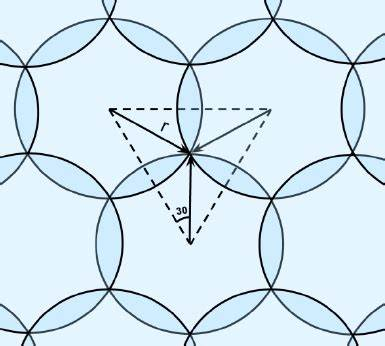

Portfolio
=========

Programming Projects
--------------------

*For access to my private project repositories, please [email me](mailto:jrwedding@csustudent.net?subject=GitHub%20Access) with the subject line, GitHub Access.

---
### [HTML Parsing and Crawling | CSCI 315](project1)

---
### [Scheduler | CSCI 431](project2)

---
### [Project 3 Title | CSCI 325](project1)

---
### [Minimum Overlap Coverage | CSCI 315](project4)

---

Ethics Papers
-------------

### [The Biggest Dilemma I Will Face as a Programmer](/pdf/EthicsPaper1.pdf)

-   **Class:** CSCI 325 Object-Oriented Programming
-   **Grade:** A

### [Copyright, Fair Use, and License Terms and Agreements](/pdf/EthicsPaper2.pdf)

-   **Class:** CSCI 301 Survey of Scripting Languages
-   **Grade:** A

### [The THERAC-25 Accidents and the Questions They Raise](/pdf/EthicsPaper3.pdf)

-   **Class:** CSCI 315 Data Structure Analysis
-   **Grade:** A

---

Presentations
-------------

### [Paging Presentation](/pdf/Paging_Presentation_pdf.pdf)

- **Class:** CSCI 431 Operating Systems
- **Grade:** A

### [The Marriott Data Breach](/pdf/Marriott_Presentation_pdf.pdf)

- **Class:** CSCI 419 Database Management
- **Grade:** A

---

Page template forked from <a href="https://github.com/csu-cs/csci-portfolio">CSU-CS</a>

<!-- Remove above link if you don't want to attributive -->
