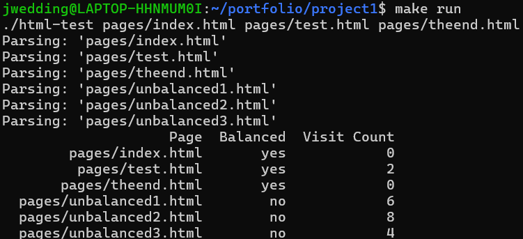

[Back to Portfolio](./)

HTML Parsing and Crawling
===============

-   **Class:** CSCI 315 Data Structure Analysis
-   **Grade:** A
-   **Language(s):** C++
-   **Source Code Repository:** [HTML Parser Repository](https://github.com/jwedding20/portfolio_proj1.git)  
    (Please [email me](mailto:example@csustudent.net?subject=GitHub%20Access) to request access.)

## Project description

It's important to know if your html tags are balanced. Given an html file, this program will tell you if the html code is balanced, as well as tell you how many unique pages can be visited from each page.

## How to compile and run the program

How to run the project.

```bash
cd ./project
make run
```

## UI Design

This project is entirely on the command line. The only interaction the program requires with the user is running it. When the user runs the program, the html files in the 'pages' folder are parsed and then their names are displayed, as well as columns displaying whether or not the pages are balanced, and how many unique pages can be visited (see Fig 1).

  
Fig 1. Output of the program

## 3. Additional Considerations

The user may add more html files to the 'pages' folder to see if it is balanced. In this file the user may also add links to other pages within the folder to see how may unique pages can be visited.


[Back to Portfolio](./)
