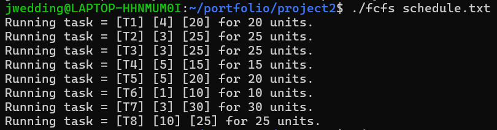
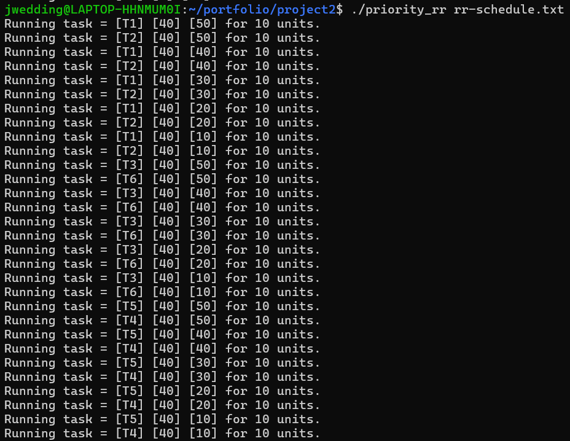

[Back to Portfolio](./)

Scheduler
===============

-   **Class:** CSCI 431 Operating Systems
-   **Grade:** A
-   **Language(s):** C
-   **Source Code Repository:** [features/mastering-markdown](https://guides.github.com/features/mastering-markdown/)  
    (Please [email me](mailto:jrwedding@csustudent.net?subject=GitHub%20Access) to request access.)

## Project description

This program takes the provided text file and creates a schedule based on the scheduling method that is input. Each line of the text file contains a task. Each taks is made up of a task number, the priority of the task, and the time it takes the task to complete. The scheduling methods that can be used are first-come-first-serve (fcfs), shortest job first (sjf), priority, round-robin (rr), and priority round-robin.

## How to compile and run the program

The compilation and running of the program depends on which scheduling method you want to use.

```bash
cd ./project
make fcfs
./fcfs schedule.txt
make sjf
./sjf schedule.txt
make priority
./priority schedule.txt
```

```bash
cd ./project
make rr
./rr rr-schedule.txt
make priority_rr
./priority_rr rr-schedule.txt
```

## UI Design

This project is entirely on the command line. The only interaction the program requires with the user is running it. When the user enters which scheduling method they want to use (and runs the program), the program displays the task that is running. The output for the fcfs, sjf, and priority methods are as follows: 

    Running task = [task number][priority][time_cost] for _ units

The output for the rr and priority-rr methods are as follows:

    Running task = [task_number][time_cost][time_remaining] for _ units

These outputs can also be seen in Figures 1 and 2, respectively.

  
Fig 1. Output of fcfs scheduling method

  
Fig 2. Output of priority-rr scheduling method

## 3. Additional Considerations

To understand what the scheduler is doing, users must have an idea of what the different scheduling methods do.


[Back to Portfolio](./)
