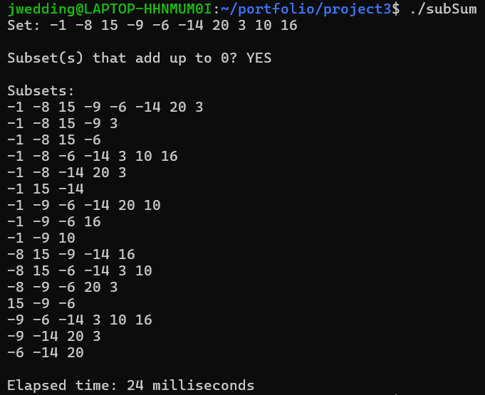

[Back to Portfolio](./)

Sum of Subsets
===============

-   **Class:** CSCI 415 Algorithms
-   **Grade:** A
-   **Language(s):** C++
-   **Source Code Repository:** [Sum of Subsets Repository](https://github.com/jwedding20/portfolio_proj3.git)  
    (Please [email me](mailto:jrwedding@csustudent.net?subject=GitHub%20Access) to request access.)

## Project description

This is a very simple program that randomly generates an array of 10 numbers from -20 to 20. It then calculates all of the possible subests that add up to 0, and outputs them to the screen.

## How to compile and run the program

How to run the project.

```bash
cd ./project
g++ -o subSum subsetSum.cpp
./subSum
```

## UI Design

This project is entirely on the command line. The only interaction the program requires with the user is running it. When the user runs the program, random set of 10 numbers is generated and output to the screen. The program then displays the subsets that add up to 0, should there be any, along with the elapsed time.

  
Fig 1. Output of the program

## 3. Additional Considerations

The program could be modified to accomodate more than 10 numbers, and a larger range than -20 to 20.


[Back to Portfolio](./)
