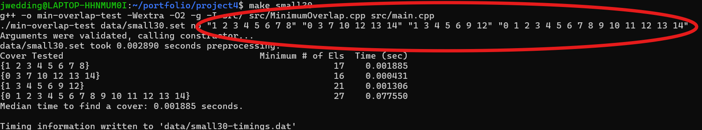
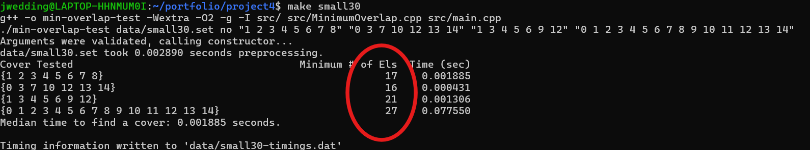
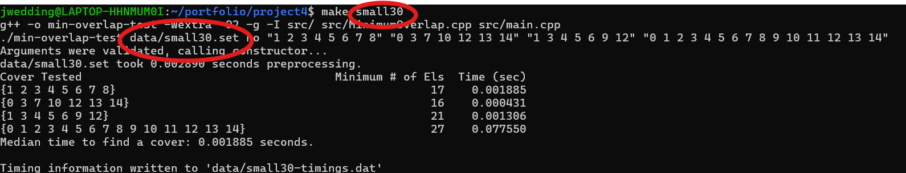
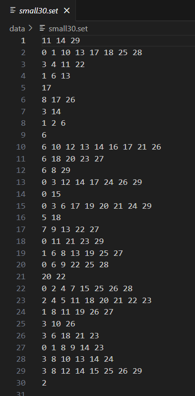
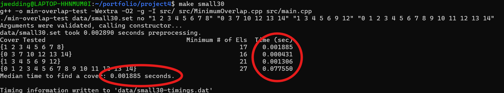

[Back to Portfolio](./)

Minimum Overlap Coverage
===============

-   **Class:** CSCI 315 Data Structure Analysis
-   **Grade:** C
-   **Language(s):** C++
-   **Source Code Repository:** [features/mastering-markdown](https://guides.github.com/features/mastering-markdown/)  
    (Please [email me](mailto:jrwedding@csustudent.net?subject=GitHub%20Access) to request access.)

## Project description

This project implementation will find the Minimum Overlap of sets that cover all points. For example, suppose we have multiple group projects for our class that needed to be presented at the end of the semester. The professor must grade every student at least once, but wants to minimize the number grades that must be performed. Your professor does not mind grading multiple projects. Students are members of multiple projects, but only want to present once. How can we minimize the number of times a student has to present? Everyone in a group has to present (no partial group presentations) and a grade must be assigned for each group member. The time it takes for each minimum overlap set to be found is recorded, and is then written to a file that can be found in the 'data' folder.

## How to compile and run the program

How to run the project.

```bash
cd ./project
make run
make small30
make med30
make large30
make large50
make small100
make small-timings
make medium-timings
make large-timings
```

## UI Design

This project is entirely on the command line. The only interaction the program requires with the user is running it. The program will take the sets provded in the last part of the make statement (Fig 1) and output the minimum number of elements needed to "cover" each set (Fig 2) using the file provided at the start (Fig 3) of the make statement (ex. large30, small100, etc.). These contents of these files can be seen in Fig 4. Timing data for each set is also displayed, along with the median time (Fig 5).

  
Fig 1. The sets that are being "covered"

  
Fig 2. The minimum number of elements is shown here

  
Fig 3. The file used to "cover"

  
Fig 4. Contents of the file shown in Fig 3

  
Fig 5. Timing data

## 3. Additional Considerations

Each set/group file contains multiple sets. Each set is contained on one line and is a space delimited list of numbers. Each number represents a student’s ID.For Example:
```bash
0 2 5
0 2 3
1
2 3 6
1 4 3
5 6
```
The smallest group that can be made for 0 2 6 contains sets 0 2 5 and 5 6 for a total of 5.


[Back to Portfolio](./)
